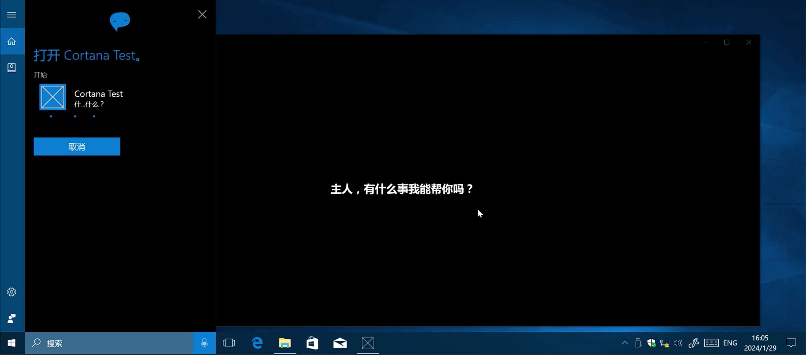

# Cortana Nana

一个使用 Cortana（小娜）语音命令的应用。

主要是研究~~和整活~~用。

# 实验平台

此应用已在断网条件下，在 Windows 10 1703 **桌面端**实验成功。

尚未找到在移动端条件下，让小娜使用此应用的语音命令的方法。

# 可用语音命令

**这里的列表可能不是最新，请以 `src/VoiceCommandDefintion.xml` 中定义的命令为准。**

语音命令中的应用名称：`娜娜`。

在小娜激活后，请念出：`娜娜 (命令内容)` 来使用此应用提供的语音命令。

---

以下是命令内容列表：

> 以下命令中，被 `[]` 括住的内容是可选的（可以不用念出来）。

- `[娜娜]你好香[啊]`

# 参考文档

[通过 Cortana 使用语音命令激活前台应用](https://learn.microsoft.com/windows/apps/design/input/cortana-launch-a-foreground-app-with-voice-commands)

[语音命令定义 (VCD) 元素和属性 v1.2](https://learn.microsoft.com/uwp/schemas/voicecommands/voice-command-elements-and-attributes-1-2)

# 许可

MIT 许可证